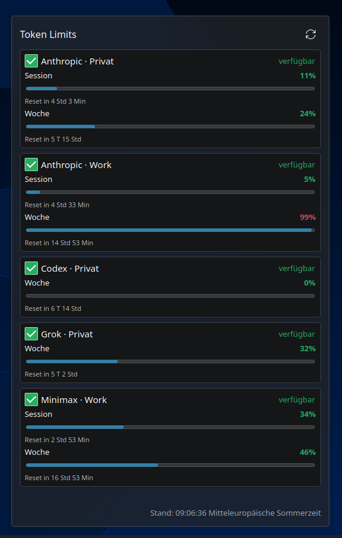

# Token Limits for Plasma 6

A KDE Plasma widget for Kubuntu/Ubuntu 26.04 LTS (tested with Plasma 6.6) that displays session and weekly usage limits for multiple AI subscriptions.

The documentation and configuration examples are in English. The widget UI and desktop notifications are currently German-only.



## Features

- Multiple accounts per provider, identified by a unique `provider + alias` pair
- Native adapters for Anthropic Claude, OpenAI Codex, xAI Grok Build, and MiniMax Coding Plan
- Provider-specific quota windows instead of invented limits
- Reset countdown for every reported window
- Configurable desktop notifications for session and weekly thresholds
- Optional notification sound with configurable file and volume
- Recovery notification when a previously limited account becomes available again
- Local credential handling: the widget only reads sanitized status data

## Installation

```bash
./install.sh
```

Open Plasma's widget browser, search for **Token Limits**, then add it to the desktop or a panel.

## Multi-account configuration

The local configuration lives at:

```text
~/.config/token-limits/config.json
```

Example:

```json
{
  "notifications": {
    "enabled": true,
    "session": 80,
    "weekly": 80,
    "sound": {
      "enabled": true,
      "file": "/usr/share/sounds/freedesktop/stereo/message.oga",
      "volume": 70,
      "events": ["threshold"]
    }
  },
  "accounts": [
    {
      "provider": "anthropic",
      "alias": "Personal",
      "credential_file": "~/.claude/.credentials.json",
      "thresholds": {"session": 80, "weekly": 85}
    },
    {
      "provider": "anthropic",
      "alias": "Work",
      "credential_file": "~/.claude-work/.credentials.json"
    }
  ]
}
```

Every provider and alias combination must be unique. Account-level `thresholds` override the global values for that account.

### Using a second Anthropic account

Claude Code supports separate configuration directories. To log in with a second account:

```bash
CLAUDE_CONFIG_DIR="$HOME/.claude-work" claude
```

Run `/login` in Claude Code and select the second account. Set `"enabled": true` for that account afterward. The login under `~/.claude` remains unchanged.

You can separate Codex accounts in the same way by using different `CODEX_HOME` directories, such as `~/.codex` and `~/.codex-work`, and referencing each `auth.json` file in the configuration.

## Grok and MiniMax

### xAI Grok Build

Grok Build is supported through `~/.grok/auth.json`. The current Grok endpoint reports a weekly window but no separate session window. The collector refreshes expired OAuth access tokens when a valid refresh token is available.

If the refresh token has expired, sign in again:

```bash
grok login --oauth
```

Example account:

```json
{
  "provider": "grok",
  "alias": "Personal",
  "credential_file": "~/.grok/auth.json"
}
```

### MiniMax Coding Plan

Store the MiniMax API key in a file with mode `600`, then reference it with `api_key_file`:

```bash
mkdir -p ~/.config/token-limits
chmod 700 ~/.config/token-limits
install -m 600 /dev/null ~/.config/token-limits/minimax-api-key
printf '%s' "$MINIMAX_API_KEY" > ~/.config/token-limits/minimax-api-key
```

```json
{
  "provider": "minimax",
  "alias": "Work",
  "api_key_file": "~/.config/token-limits/minimax-api-key",
  "base_url": "https://api.minimax.io"
}
```

MiniMax reports both the current coding-plan interval and a weekly window when they are available. The collector prefers identifiable coding products such as `general`, accepts a single unlabeled row for compatibility, and reports ambiguous multi-product responses as errors instead of displaying unrelated quotas. Set `product_name` to select an exact provider product label if MiniMax changes its naming.

## Custom adapters

The built-in `command` and `json_url` adapters can handle additional providers or endpoint changes.

A command adapter must print one canonical JSON object to standard output:

```json
{
  "available": true,
  "session": {"used_percent": 52, "reset_at": "2026-08-08T18:00:00Z"},
  "weekly": {"used_percent": 71, "reset_at": 1786536000}
}
```

Example configuration:

```json
{
  "provider": "custom-provider",
  "alias": "Personal",
  "adapter": "command",
  "command": ["/home/user/.local/bin/provider-quota-json"]
}
```

The `json_url` adapter accepts `url`, optional `headers`, and `bearer_token_file`. Never place secrets directly in the configuration or status file.

## Privacy and local data

- The QML widget only reads normalized status data. It contains no provider networking or credential code.
- Only the local Python collector reads credential files listed in `~/.config/token-limits/config.json`.
- Tokens, API keys, email addresses, and raw provider responses are not written to status files, logs, or notifications.
- `.gitignore` excludes `config.json`, `auth.json`, `.credentials.json`, `.env`, tokens, keys, status files, and notification state.
- `config.example.json` contains placeholder paths and no credentials.

## Notifications and sound

The default threshold is 80 percent for session and weekly windows. A notification is sent once per account, window, threshold, and reset cycle.

Sound configuration:

```json
"sound": {
  "enabled": true,
  "file": "/usr/share/sounds/freedesktop/stereo/message.oga",
  "volume": 70,
  "events": ["threshold"]
}
```

Use `"events": ["threshold", "available_again"]` to play the sound for recovery notifications as well. The collector uses `paplay` and falls back to `pw-play`.

## Service and troubleshooting

```bash
systemctl --user status token-limits.timer token-limits.service
journalctl --user -u token-limits.service --since today
token-limits-collector --no-notify
```

Quota requests automatically retry HTTP 429 responses up to two times. Short
`Retry-After` values (seconds or HTTP dates) are respected; responses without
that header use bounded exponential backoff with jitter. To avoid blocking the
collector or violating a server-requested cooldown, `Retry-After` delays longer
than 10 seconds are not shortened or waited out—the next five-minute timer run
tries again instead. All providers share a 90-second retry budget. Retry delays
and the measured runtime of retry requests consume it; normal first attempts and
unrelated request latency do not. Configure the top-level `retry_budget_seconds`
with a non-negative number (`0` disables retries); missing, negative, or invalid
values use 90 seconds. Retry requests keep their configured timeout when it fits;
otherwise it is capped to the remaining budget. A retry is skipped if less than
five seconds remain after its delay. If a capped retry times out, the original
HTTP 429 error is preserved. Fetch errors are shown as unavailable, but do not
overwrite the last successful notification state,
preventing false "available again" alerts.

Generated files:

```text
~/.local/share/token-limits/status.json
~/.local/state/token-limits/state.json
```

After changing the configuration:

```bash
systemctl --user start token-limits.service
```

## Tests

```bash
python3 -m unittest discover -s tests -v
```

## API stability

The Claude, Codex, Grok, and MiniMax subscription endpoints are used by their respective local clients, but they are not guaranteed long-term public billing APIs. Adapter errors are isolated per account, so one provider failure does not prevent the other accounts from updating.

## License

MIT
